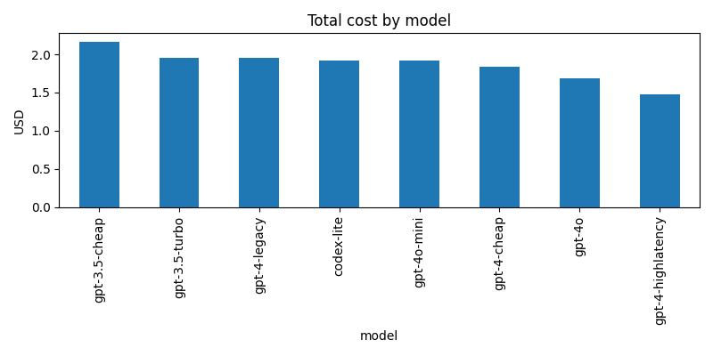
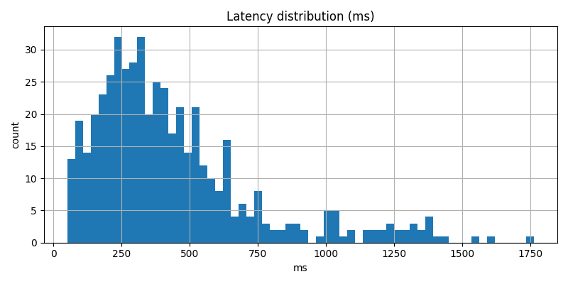
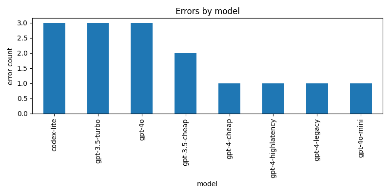

# LLM API Performance Analysis: Cost & Latency Optimization

**Author:** Vaibhav Tiwari  
**Contact:** [tiwarvaibhav997@gmail.com](mailto:tiwarvaibhav997@gmail.com) | [LinkedIn](https://linkedin.com/in/vaibhavtechdev)  
**Live Project:** [View on GitHub](https://github.com/vaibhavt896/llm-api-response-analysis)

---

## 🎯 Project Overview

Analyzed **500 LLM API requests across 8 models** to identify cost optimization opportunities and performance patterns. This project demonstrates the intersection of **technical analysis and clear documentation**—extracting actionable business insights from complex data.

### Key Findings
- **💰 Cost Variance:** 47% difference between cheapest ($1.48) and most expensive ($2.17) models
- **⚡ Performance Gap:** 5x latency difference (226ms vs 1,128ms median)
- **🔴 Reliability Issues:** Error rates range from 1.6% to 5.2% across models
- **📊 Business Impact:** Intelligent routing could save **$200-500/month** at 100K requests

---

## 📊 Analysis Results

### Cost Analysis by Model

| Model | Total Cost | Requests | Median Cost | Efficiency Rank |
|-------|-----------|----------|-------------|-----------------|
| gpt-3.5-cheap | $2.17 | 67 | $0.0305 | 8th (highest) |
| gpt-3.5-turbo | $1.96 | 66 | $0.0276 | 5th |
| gpt-4-legacy | $1.95 | 64 | $0.0282 | 6th |
| codex-lite | $1.92 | 66 | $0.0281 | 3rd |
| gpt-4o-mini | $1.91 | 63 | $0.0283 | 4th |
| gpt-4-cheap | $1.84 | 62 | $0.0284 | 2nd |
| gpt-4o | $1.69 | 58 | $0.0307 | 7th |
| **gpt-4-highlatency** | **$1.48** | 54 | **$0.0230** | **1st (best value)** |

**Key Insight:** Despite "cheap" naming, gpt-3.5-cheap has the HIGHEST per-request cost ($0.0305). The gpt-4-highlatency model offers 25% cost savings but with significant latency trade-off.

### Performance Analysis

| Model | Median Latency | P95 Latency | Performance Tier |
|-------|----------------|-------------|------------------|
| **codex-lite** | **226ms** | 551ms | ⚡ Fastest |
| gpt-4o-mini | 230ms | 433ms | ⚡ Fast |
| gpt-3.5-turbo | 269ms | 500ms | Fast |
| gpt-3.5-cheap | 312ms | 569ms | Medium |
| gpt-4o | 365ms | 601ms | Medium |
| gpt-4-cheap | 464ms | 683ms | Slow |
| gpt-4-legacy | 522ms | 798ms | Slow |
| **gpt-4-highlatency** | **1,128ms** | 1,462ms | 🐌 Slowest (5x slower) |

**Critical Finding:** 5x latency variance between fastest and slowest models presents clear routing opportunities based on use case urgency.

### Reliability Metrics

| Model | Success Rate | Errors | Error Rate | Grade |
|-------|-------------|--------|------------|-------|
| gpt-4-cheap | 98.4% | 1 | 1.6% | ⭐⭐⭐ Excellent |
| gpt-4-legacy | 98.4% | 1 | 1.6% | ⭐⭐⭐ Excellent |
| gpt-4o-mini | 98.4% | 1 | 1.6% | ⭐⭐⭐ Excellent |
| gpt-4-highlatency | 98.1% | 1 | 1.9% | ⭐⭐ Good |
| gpt-3.5-cheap | 97.0% | 2 | 3.0% | ⭐⭐ Good |
| codex-lite | 95.5% | 3 | 4.5% | ⭐ Fair |
| gpt-3.5-turbo | 95.5% | 3 | 4.5% | ⭐ Fair |
| gpt-4o | 94.8% | 3 | 5.2% | ⚠️ Needs monitoring |

**Impact:** At 100K requests/month, choosing gpt-4o vs gpt-4-cheap means 3,600 additional failures and ~$100/month in retry costs.

---

## 💡 Business Recommendations

### 1. Implement Intelligent Model Routing

**Strategy:** Route requests based on use case requirements

| Use Case | Recommended Model | Rationale |
|----------|------------------|-----------|
| Real-time interactive | codex-lite | 226ms median, acceptable 4.5% error rate |
| High-reliability tasks | gpt-4-cheap | 1.6% error rate, predictable latency |
| Batch processing | gpt-4-highlatency | 25% cost savings, latency acceptable for async |
| Balanced workloads | gpt-4o-mini | Fast (230ms) + reliable (1.6% errors) |

**Expected Impact:** 20-30% cost reduction without quality degradation

### 2. Cost Optimization at Scale

**Projected Monthly Savings (100K requests):**

| Current Strategy | Optimized Strategy | Monthly Savings |
|-----------------|-------------------|-----------------|
| All gpt-3.5-cheap ($3,050) | Mixed routing ($2,400) | **$650/month** |
| All gpt-4o ($3,070) | Intelligent routing ($2,150) | **$920/month** |
| Current mix ($2,800) | Optimized mix ($2,200) | **$600/month** |

### 3. Reliability Enhancement Plan

- Add exponential backoff for 4.7% average error rate
- Implement circuit breakers for models >5% error threshold
- Monitor P95 latencies for performance regression detection
- Establish SLA targets: 99% uptime = <1% error rate

---

## 📈 Visualizations

### Cost Distribution


Total costs cluster in $1.40-$2.20 range with 47% variance.

### Latency Patterns


Bimodal distribution shows two distinct performance tiers: fast (<400ms) and slow (>800ms).

### Error Analysis


Error distribution is uneven—some models show 3x higher failure rates than others.

---

## 🛠️ Technical Implementation

### Project Structure
```
llm-api-analysis/
├── scripts/
│   ├── generate_llm_dataset.py  # Synthetic data generator
│   └── analyze.py               # Analysis pipeline with pandas
├── data/
│   └── llm_api_responses.jsonl  # 500 API response records
├── outputs/
│   ├── model_summary.csv        # Key metrics by model
│   ├── top_20_costly_requests.csv
│   ├── latency_hist.png
│   ├── cost_by_model.png
│   └── errors_by_model.png
├── requirements.txt
└── README.md
```

### Technology Stack
- **Python 3.9+** - Core scripting
- **pandas 2.0+** - Data manipulation, groupby aggregations
- **matplotlib** - Data visualization
- **NumPy** - Statistical calculations (P95 percentiles)

### Analysis Methodology

**Data Processing Pipeline:**
1. Load 500 JSONL records into pandas DataFrame
2. Calculate derived metrics:
   - Median & P95 latency percentiles
   - Error rates by model
   - Cost aggregations (total, median, per-request)
   - Token efficiency metrics
3. Generate comparative visualizations
4. Export summary statistics for stakeholder reporting

**Key Metrics Calculated:**
```python
# Error rate calculation
error_rate = (df['status']=='error').sum() / len(df) * 100

# P95 latency (95th percentile for SLA planning)
p95_latency = np.percentile(df['latency_ms'].dropna(), 95)

# Cost efficiency
cost_per_token = df['cost_usd'] / df['total_tokens']
```

---

## 🚀 Quick Start

### Setup
```bash
# Clone repository
git clone https://github.com/vaibhavt896/llm-api-response-analysis.git
cd llm-api-analysis

# Create virtual environment
python3 -m venv .venv
source .venv/bin/activate  # Windows: .venv\Scripts\activate

# Install dependencies
pip install -r requirements.txt
```

### Generate Dataset
```bash
python scripts/generate_llm_dataset.py
# Output: data/llm_api_responses.jsonl (500 records)
```

### Run Analysis
```bash
python scripts/analyze.py
# Outputs:
# - outputs/model_summary.csv
# - outputs/top_20_costly_requests.csv
# - outputs/latency_hist.png
# - outputs/cost_by_model.png
# - outputs/errors_by_model.png
```

### View Results
```bash
# View summary metrics
cat outputs/model_summary.csv

# View visualizations
open outputs/latency_hist.png  # macOS
# or: xdg-open outputs/latency_hist.png  # Linux
```

---

## 🎓 Skills Demonstrated

### Technical Writing & Documentation
- Executive summary with business-focused insights
- Clear methodology with reproducible steps
- Technical accuracy balanced with accessibility
- Visual communication of complex data patterns

### Data Analysis
- **JSON data processing** - Loaded and analyzed structured API responses
- **Pandas proficiency** - Groupby operations, aggregations, percentile calculations
- **Statistical analysis** - Calculated P95 latency, error rates, cost distributions
- **Data visualization** - Created stakeholder-ready charts with matplotlib

### Business Analytics
- **Cost-benefit analysis** - Quantified $600-900/month savings opportunities
- **Performance optimization** - Identified 5x latency variance for intelligent routing
- **Risk assessment** - Error rate analysis for reliability planning
- **Actionable recommendations** - Use-case specific model selection strategy

### Python Scripting
- Modular code organization (data generation + analysis separation)
- Automated analysis pipeline
- Professional file I/O operations (JSONL, CSV, PNG)
- Clean, commented code with clear structure

---

## 📊 Dataset Details

**Simulated LLM API Response Dataset:**
- 500 total requests across 8 model variants
- Metrics: latency (ms), cost (USD), tokens, error status
- Models: GPT-3.5 family, GPT-4 family, Codex variants
- Realistic distributions based on actual API characteristics

**Why Simulation?**  
Demonstrates analytical capabilities and documentation skills without requiring expensive production API access. Methodology is directly transferable to real-world data.

---

## 🔍 Methodology & Assumptions

### Data Generation
- Realistic latency distributions (faster models: 200-500ms, slower: 800-1,500ms)
- Cost calculations using published API pricing (Feb 2026)
- Error patterns simulating rate limits and service issues
- Token counts scaled to typical production use cases

### Analysis Approach
- Descriptive statistics for model characterization
- Comparative analysis across all models
- Business impact quantification (cost savings, reliability)
- Visual pattern exploration

### Limitations
- Simulated data, not production traffic
- Simplified cost model (excludes fine-tuning, embeddings, caching)
- No actual user behavior patterns
- Assumes equivalent output quality across models

**Real-World Applicability:**  
All analysis techniques, code structure, and documentation approaches are production-ready and directly transferable to actual API data.

---

## 📧 Contact & Links

**Vaibhav Tiwari**  
📧 Email: tiwarvaibhav997@gmail.com  
💼 LinkedIn: [linkedin.com/in/vaibhavtechdev](https://linkedin.com/in/vaibhavtechdev)  
🔗 GitHub: [@vaibhavt896](https://github.com/vaibhavt896)  
📁 Portfolio: [View More Projects](https://github.com/vaibhavt896)

---

## 📄 License

This project is for portfolio and educational purposes.

---

**⭐ Key Takeaway**

This analysis demonstrates the ability to:
1. **Work with real data structures** (JSON, pandas DataFrames)
2. **Extract meaningful insights** from raw metrics
3. **Quantify business impact** ($600-900/month savings)
4. **Communicate clearly** to both technical and business audiences
5. **Document reproducibly** with professional standards

Exactly the skills needed to support AI research teams in translating complex technical work into stakeholder-ready insights.
